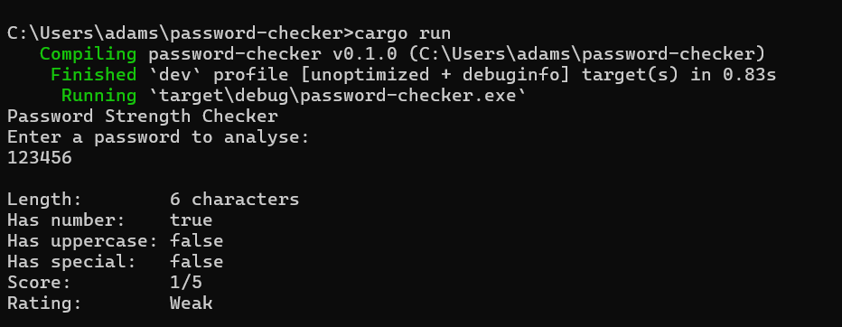
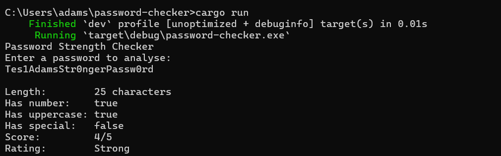

# Rust Password Checker

This is my first Rust project. I have been working through cybersecurity
projects and building things in Python, and I wanted to start learning Rust
properly because it is increasingly relevant in security tooling. The best
way I know how to learn a language is to build something small and real with
it rather than follow a tutorial that produces nothing useful at the end.

Thanks to friends I met from the TryHackMe discord server, I have been able to
get good resources for learning Rust.

I already built a full password analyser in Python that checks passwords
against the HaveIBeenPwned database and generates HTML reports. This is the
same core idea, written from scratch in Rust to understand how the language
works at a basic level. Same problem, different language, completely different
experience writing it.

---

## What It Does

Takes a password as input and runs it through four checks. Each check
contributes to a score out of 5. The final score maps to a rating of
Weak, Medium, or Strong.

The checks are:

- Length: 2 points if 15 or more characters, 1 point if 8 to 14, 0 if below 8
- Contains a number: 1 point
- Contains an uppercase letter: 1 point
- Contains a special character: 1 point

The length check is weighted higher because length is the single most
important factor in password strength according to NIST SP 800-63B. A long
password with no complexity is harder to crack than a short complex one.

---

## Examples

Weak password:



Strong password:



---

## How to Run

Make sure Rust is installed. If not, go to https://rustup.rs and follow
the instructions.

```
git clone https://github.com/Adam-Suvarna/rust-password-checker
cd rust-password-checker
cargo run
```

Type your password when prompted and press Enter.

---

## What I Learned

Rust is genuinely different from Python in ways that matter. Every variable
has an explicit type. Every function declares what it accepts and what it
returns. Variables are immutable by default and you have to explicitly mark
them as mutable when you need to change them. The compiler refuses to build
code that could cause memory problems, which means if it compiles, a whole
class of common bugs simply cannot exist.

The `&str` vs `String` distinction took the most getting used to. In Python
a string is just a string. In Rust there is a difference between a string
reference you are borrowing to look at and a String you own and can modify.
That distinction felt unnecessary at first and then started making sense once
I understood why Rust cares about who owns what.

This is the start. The plan is to keep building small things in Rust
alongside the Python and security work to get comfortable with the language
before moving on to anything more complex.

---

## Project Structure

```
Rust-Password-Checker/
|
+-- src/
|   +-- main.rs
+-- Cargo.toml
+-- screenshots/
    +-- weak_test.png
    +-- strong_test.png
```

---

*Tools: Rust, Cargo*
